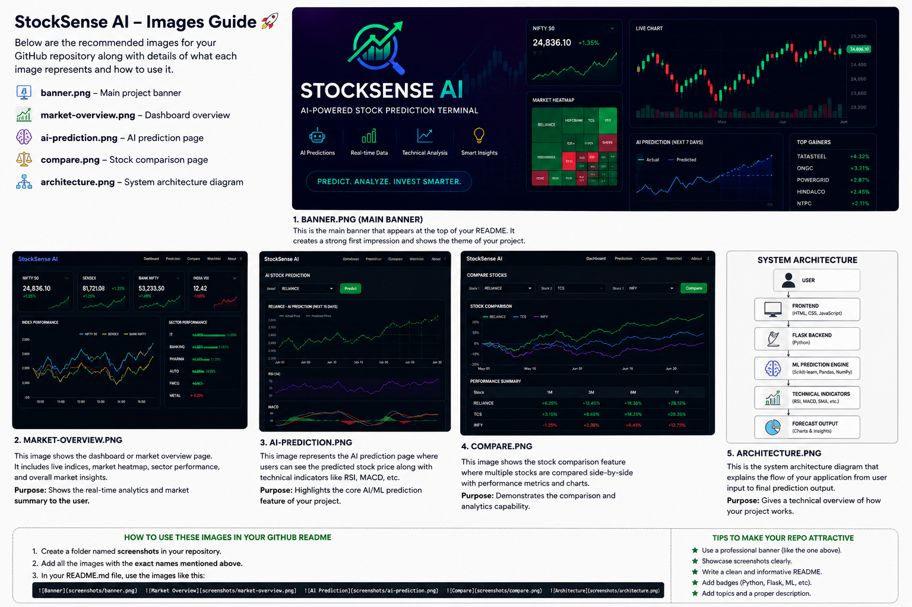
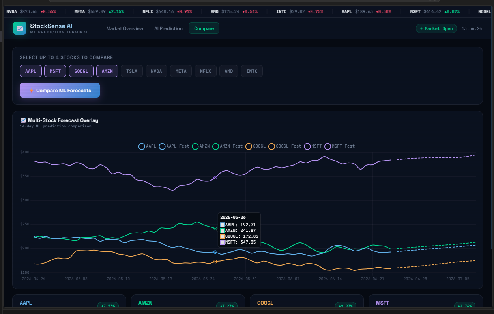
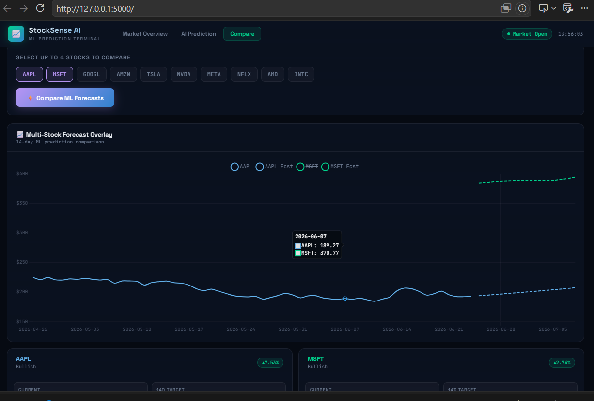
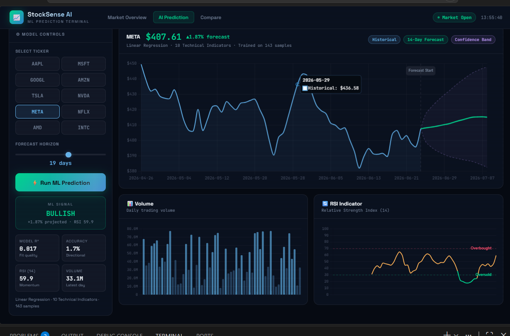

# 📈 StockSense AI

### AI-Powered Stock Prediction Dashboard

Predict stock trends using Machine Learning, technical indicators, and interactive visualizations.



## ✨ Features

* 📊 Real-time Market Dashboard
* 🤖 AI Stock Price Prediction
* 📈 Technical Indicators
* 🔄 Multi-Stock Comparison
* 📉 Forecast Visualization
* ⚡ Flask Backend

## 🛠️ Tech Stack

| Layer    | Technology            |
| -------- | --------------------- |
| Backend  | Flask                 |
| Language | Python                |
| ML       | NumPy                 |
| Frontend | HTML, CSS, JavaScript |
| Charts   | Chart.js              |

## 📸 Application Preview

### AI Prediction Engine



### Stock Comparison



### System Architecture



## 🚀 Run Locally

```bash
git clone https://github.com/swayamgupta592006-gif/StockSense-AI.git

cd StockSense-AI

pip install -r requirements.txt

python app.py
```

## 📂 Project Structure

```text
StockSense-AI
├── app.py
├── requirements.txt
├── README.md
├── screenshots
└── templates
    └── index.html
```

## 🎯 Project Goal

StockSense AI demonstrates Machine Learning, Flask web development, data visualization, and financial analytics in a modern dashboard application.

